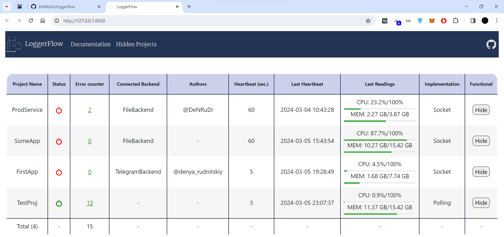
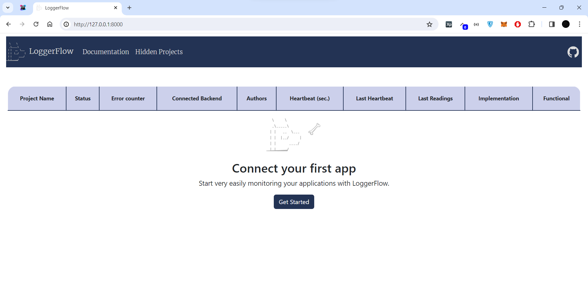
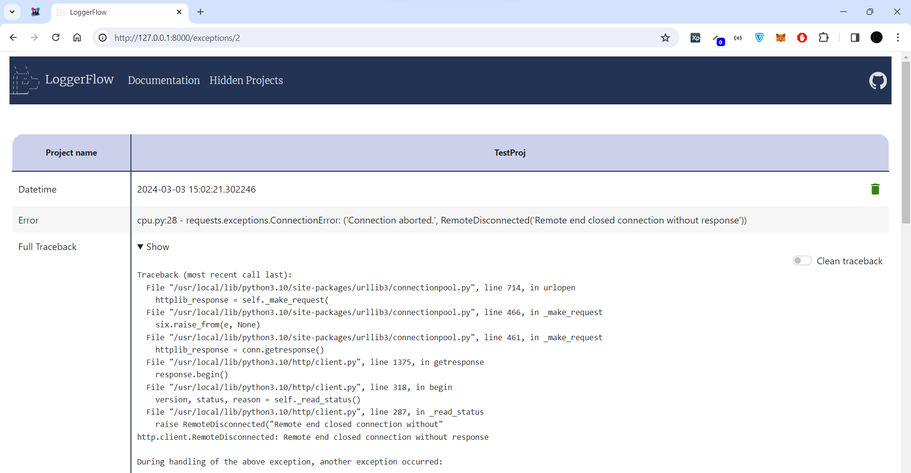
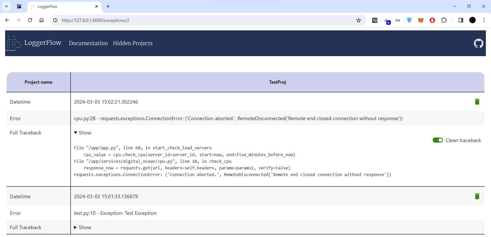

## LoggerFlow

```
  \     \
  _\_____\
 | |   __  \___       /     __     __    __   ___   ___   ----         __
 | |  |__/     |     /    /   /  / __  / __  /__   /  /  /___  /     /   /   /  /  /
 | |      ____/     /___ /___/  /___/ /___/ /___  /     /     /___  /___/   /__/__/
 |_|_____/
```

<h3>A new level of bug tracking for your Python projects.</h2>



<details>
  <summary>Changes (0.0.5 - actual)</summary>

 - v. 0.0.5
   - added tracking the status of your applications, use class `WebhookLifecycle` and `WebSocketLifecycle`; 
   - rename method `send_traceback_to_backend` to `send_traceback`;
   - added async methods `async_send_data`  and `async_send_traceback`;
   - fix bug with second send to backend with spaces and `\n`;
   - big changes in project architecture;
   - add example with `Celery`-connect and showing creating your custom backends;
 - v. 0.0.4
    - improved stacktrace cleaning for `traceback='clean'`;
    - template for tracking the status of projects (will be added in v. 0.0.5);
    - rename method `exclude_sending_filter` to `exclude`;
    - added method `send_traceback_to_backend` for manual sending of traceback to the backend;
    - changes in project architecture.

  - v. 0.0.3
    - added the `traceback='full'` attribute to the LoggerFlow constructor, which allows you to send full, clean or minimal traceback to the backend (depending on your preferences).
    You can pass 3 parameters:
        - `full` -  Sending full traceback on your backend/backends;
        - `clean` - Sending your program's stacktrace (clearing lines that were are called from libraries);
        - `minimal` - Sending a 1 line with name file, number line and last line of your traceback;
    - minor fixes in project architecture;
    - writing documentation for project.
  - v. 0.0.2
    - added logging in threads (to disable logging in threads - pass the parameter `thread_logging=False` to the LoggerFlow constructor);
    - minor fixes;
  - v. 0.0.1 
    - create project LoggerFlow;
</details>

## Simple start with Lifecycle
<details>
    <summary>Info about Loggerflow Lifecycle</summary>
    
To take advantage of state tracking for your applications, you need to do 2 things:
    
<b>1) Run `LoggerFlow` Server WebInterface</b>.

If you are familiar with `Celery` or `Flower`, this will be very easy for you. 
You need to enter the command in console:
    
    loggerflow run --host 127.0.0.1 --port 8000

By default, the server uses a `sqlite3` database, with `sqlalchemy` as the engine. 
You can change the database by passing the sqlalchemy connection string, passing the `-d` or `--database` flag, but 
you should only use <b>async engine</b>.
You can also customize the server for yourself, including authorization via the `--auth` flag.

<details>
<summary>Additional commands</summary>
    
    -u --host | Host to run LoggerFlow server
    -p --port | Port to run LoggerFlow server
    -d --database | SQLAlchemy database connection string, default is "sqlite+aiosqlite:///loggerflow.db"
    -a --auth | Auth credentials in format login:password
    --disable-log | Disable uvicorn log in terminal
</details>

After server running you will see in browser this page:



<b>2) Connect your app to `LoggerFlow` Server</b>

After server running you can connect your application with a few lines of code.
Select `WebhookLifecycle` or `WebSocketLifecycle` class depending on your preference.

Example with `WebhookLifecycle`:

    from loggerflow.lifecycle import WebhookLifecycle
    from loggerflow import LoggerFlow
    
    lifecycle = WebhookLifecycle(webhook_url='http://127.0.0.1:8000/loggerflow/')
    
    lf = LoggerFlow(project_name='TestProj', backend=lifecycle)
    lf.run()
    
Example with `WebSocketLifecycle`:

    from loggerflow.lifecycle import WebSocketLifecycle
    from loggerflow import LoggerFlow
    
    lifecycle = WebSocketLifecycle(websocket_url='ws://127.0.0.1:8000/loggerflow/')
    
    lf = LoggerFlow(project_name='TestProj', backend=lifecycle)
    lf.run()

<b>And that's it, it's so simple!</b>

In the browser you will see something like:


In the browser, you can track errors that occurred in your applications, 
view detailed tracebacks, and, if necessary, clear unnecessary library calls in the stacktrace, showing 
only your lines of code.

Example with full stacktrace from your app:



Example with clean stacktrace from your app:
    


</details>

##  Simple start without Lifecycle

<details>
    <summary>Info about Loggerflow </summary>

<h5> Example with Telegram backend: </h5>

    from loggerflow.backends import TelegramBackend
    from loggerflow import LoggerFlow
    
    
    backend = TelegramBackend(
        token='telegram_token',
        chat_id=-123456789,
        authors=['@DeNRuDi', ]
    )
    
    lf = LoggerFlow(project_name='Test', backend=backend)
    lf.run()
    
    raise Exception('Test Error')
    
    
<h5> Example with multiple backends: </h5>
    
    from loggerflow.backends import TelegramBackend, DiscordBackend
    from loggerflow import LoggerFlow
    
    backend_telegram = TelegramBackend(
        token='bot_token',
        chat_id=-1234567890,
        authors=['@telegram_username', ]
    )
    
    backend_discord = DiscordBackend(
        webhook_url='webhook_url',
        authors=['@discord_username', ]
    )
    
    lf = LoggerFlow(project_name='Test', backend=[backend_telegram, backend_discord])
    lf.run()
    
    raise Exception('Test Error')
    
    
<h5> Exclude traceback which should not be sent: </h5>
    
    
    lf = LoggerFlow(project_name='Test', backend=backend)
    lf.exclude('ValueError')
    lf.exclude('502 Bad Gateway')
    lf.run()
</details>

## Simple integrations with frameworks
<details>
    <summary>Django</summary>

File `settings.py`:
```
import os
from pathlib import Path

from loggerflow.backends import FileBackend
from loggerflow import LoggerFlow

# Build paths inside the project like this: BASE_DIR / 'subdir'.
BASE_DIR = Path(__file__).resolve().parent.parent


# Quick-start development settings - unsuitable for production
# See https://docs.djangoproject.com/en/4.2/howto/deployment/checklist/

# SECURITY WARNING: keep the secret key used in production secret!
SECRET_KEY = os.getenv('SECRET_KEY')

# SECURITY WARNING: don't run with debug turned on in production!
DEBUG = False

ALLOWED_HOSTS = ['*']


lf = LoggerFlow(project_name='Test', backend=FileBackend('test.log'), traceback='clean')
lf.run()
```
</details>


<details>
    <summary>FastAPI</summary>

`FastAPI` already contains an automatic excepthook-handler, so errors must be sent
using the `lf.async_send_traceback` or `lf.send_traceback` method.

Example:
```
from loggerflow.backends import FileBackend
from loggerflow import LoggerFlow

from fastapi.responses import JSONResponse
from fastapi import FastAPI

import traceback
import uvicorn

app = FastAPI()
lf = LoggerFlow(project_name='Test', backend=FileBackend(file='test.log'), traceback='clean')


@app.get('/')
async def index():
    return {"status": 200}


@app.exception_handler(Exception)
async def exception_handler(request, exc):
    await lf.async_send_traceback(traceback.format_exc())
    return JSONResponse({'status': 500})


if __name__ == '__main__':
    uvicorn.run(app=app)
```
</details>

<details>
    <summary>Celery</summary>

`Celery` already contains an automatic excepthook-handler, so errors must be sent using 
the `lf.send_traceback` method.

File `celery.py` in Django project. 

Example:
```
from celery.signals import task_failure
from celery import Celery

from loggerflow.backends import FileBackend
from loggerflow import LoggerFlow

import traceback
import os

os.environ.setdefault('DJANGO_SETTINGS_MODULE', 'your_app.settings')

app = Celery('your_app')
lf = LoggerFlow(project_name='Celery Project', backend=FileBackend(file='celery.log'))


@task_failure.connect
def handle_task_failure(sender=None, exception=None, traceback_obj=None, **kwargs):
    lf.send_traceback(traceback.format_exc())


app.config_from_object('django.conf:settings', namespace='CELERY')
app.conf.timezone = 'Europe/Kiev'

app.conf.beat_schedule = {
    ...
}

app.autodiscover_tasks()

```
</details>

## Creating custom backend

To create a custom backend, you need to inherit from `AbstractBackend`, and 
be sure to override 2 method `write_flow(text: str, project_name: str, *args, **kwargs)`.

Let's give a simple example for writing to Redis:
<details>
    <summary>Custom RedisBackend</summary>

    # pip3 install redis
    from redis import Redis
    
    from loggerflow.backends.abstract_backend import AbstractBackend
    from loggerflow import LoggerFlow
    
    
    class CustomRedisBackend(AbstractBackend):
    
        def __init__(self, redis_path: str, port: int = 6379, db: int = 0):
            self.redis = Redis(host=redis_path, port=port, db=db)
    
        def write_flow(self, text: str, project_name: str, *args, **kwargs):
            print('Writing data in Redis')
            self.redis.set(project_name, text.encode())
            # or your custom logic
    
            # ATTENTION! Don't use print(text) in this function
            # as it results in a recursive search "Traceback" and therefore an error.
            # If you want to see a 'text' - use, for example, library 'loguru'.
            
            # pip3 install loguru
            # from loguru import logger
            # logger.debug(text)
    
        async def async_write_flow(self, text: str, project_name: str, *args, **kwargs):
            # method not necessary if you are not using async calls
            raise NotImplementedError
    
    
    lf = LoggerFlow(project_name='Redis Backend', backend=CustomRedisBackend(redis_path='localhost'))
    lf.run()
    
    raise Exception('Your test exception')

</details>