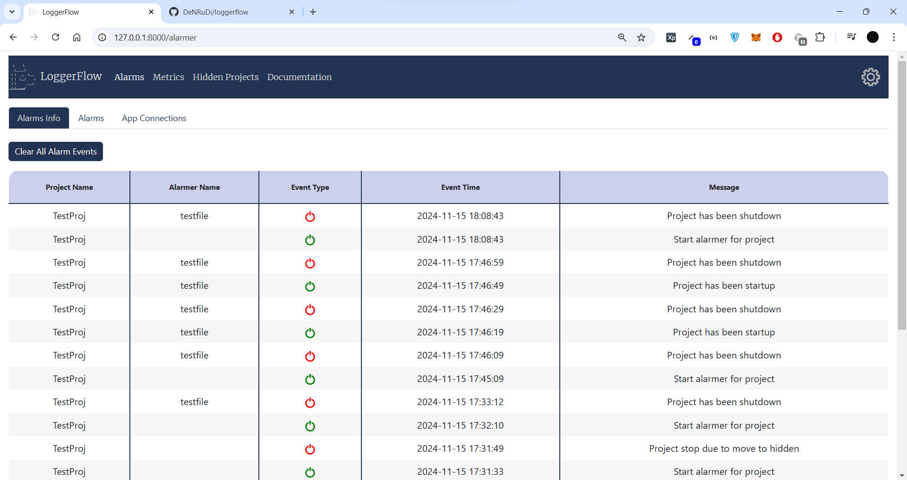

## LoggerFlow

```
  \     \
  _\_____\
 | |   __  \___       /     __     __    __   ___   ___   ----         __
 | |  |__/     |     /    /   /  / __  / __  /__   /  /  /___  /     /   /   /  /  /
 | |      ____/     /___ /___/  /___/ /___/ /___  /     /     /___  /___/   /__/__/
 |_|_____/
```

<h3>Simple and fast solution of bug tracking for your Python projects and backlight your project lines in traceback for during development.</h2>


**Loggerflow is not just a library for tracking the status of your projects. This library is:**.
 - stacktracer with backlighting of **your project calls** (you most likely haven't seen anything like this before);
 - trace collector, quick connection and sending traceback to `Telegram`, `Discord` or `File`, as well as a ready-made interface for quick connection of your backend for sending traces;
 - lifecycle dashboard of connected projects, display of a clean traceback with a call only from your project;
 - statistics with graphs up to 7 days of your application by cpu/proceess memory/total memory;
 - fast alarms connection to projects, as well as a ready-made interface for quick connection of your alarms;
 - connection of projects in lifecycle based on webhook or websocket;
 - convenient and universal logger for writing to an existing or created backend logs (and not only) with synchronous/asynchronous methods.

<details>
  <summary>Changes (0.0.6 - actual)</summary>
 
- v. 0.0.6 
   - added metrics tracking of connected applications via lifecycle;
   - added alarm tracking of connected applications via lifecycle (in 0.0.7 will be added triggers and improved version);
   - added example with create custom alarmer, and connect to LoggerFlow Lifecycle;
   - added support for tracking process memory consumption (core `psutil`);
   - added in error window displays backlighting tracebacks your project lines of code. This can be disabled in the settings.
   - the dog's eye closes when you switch from the main page to another tab:);
   - improved traceback cleaning, bug fixes with cleaning;
   - fix bugs with websocket lifecycle;
   - redesigned dashboard with a nice interface, also added settings;
   - complete transfer of event loop manual management to `asyncio.run`. You can still pass your loop, but then you have to manage it yourself;
   - improved traceback cleaning, bug fixes with cleaning;
   - added traceback backlighter for your project line in traces, use for this `TracebackBacklighter`;
   - in 0.0.7 will be added improved authorization and backend secret key for requests; 
   - **0.0.6 version is not compatible with 0.0.5 version (server and client). In 0.0.7 will be added support for such cases with projects when the versions differ.**
 - v. 0.0.5
   - added tracking the status of your applications, use class `WebhookLifecycle` and `WebSocketLifecycle`; 
   - rename method `send_traceback_to_backend` to `send_traceback`;
   - added async methods `async_send_data`  and `async_send_traceback`;
   - fix bug with second send to backend with spaces and `\n`;
   - big changes in project architecture;
   - add example with `Celery`-connect and showing creating your custom backends;
 - v. 0.0.4
    - improved stacktrace cleaning for `traceback='clean'`;
    - template for tracking the status of projects (will be added in v. 0.0.5);
    - rename method `exclude_sending_filter` to `exclude`;
    - added method `send_traceback_to_backend` for manual sending of traceback to the backend;
    - changes in project architecture.

  - v. 0.0.3
    - added the `traceback='full'` attribute to the LoggerFlow constructor, which allows you to send full, clean or minimal traceback to the backend (depending on your preferences).
    You can pass 3 parameters:
        - `full` -  Sending full traceback on your backend/backends;
        - `clean` - Sending your program's stacktrace (clearing lines that were are called from libraries);
        - `minimal` - Sending a 1 line with name file, number line and last line of your traceback;
    - minor fixes in project architecture;
    - writing documentation for project.
  - v. 0.0.2
    - added logging in threads (to disable logging in threads - pass the parameter `thread_logging=False` to the LoggerFlow constructor);
    - minor fixes;
  - v. 0.0.1 
    - create project LoggerFlow;
</details>

## Simple start with Lifecycle
<details>
    <summary>Info about Loggerflow Lifecycle</summary>
    
To take advantage of state tracking for your applications, you need to do 2 things:
    
<b>1) Run `LoggerFlow` Server WebInterface</b>.

If you are familiar with `Celery` or `Flower`, this will be very easy for you. 
You need to enter the command in console:
    
    loggerflow run --host 127.0.0.1 --port 8000

By default, the server uses a `sqlite3` database, with `sqlalchemy` as the engine. 
You can change the database by passing the sqlalchemy connection string, passing the `-d` or `--database` flag, but 
you should only use <b>async engine</b>.
You can also customize the server for yourself, including authorization via the `--auth` flag.

<details>
<summary>Additional commands</summary>
    
    -u --host | Host to run LoggerFlow server
    -p --port | Port to run LoggerFlow server
    -d --database | SQLAlchemy database connection string, default is "sqlite+aiosqlite:///loggerflow.db"
    -a --auth | Auth credentials in format login:password
    --disable-log | Disable uvicorn log in terminal
    -c --custom-alarm | single class or comma-separated list of custom alarm classes (e.g., "name_of_file.CustomAlarmBackend, test.AnotherAlarm")')

</details>

After server running you will see in browser this page:


<b>2) Connect your app to `LoggerFlow` Server</b>

After server running you can connect your application with a few lines of code.
Select `WebhookLifecycle` or `WebSocketLifecycle` class depending on your preference.

Example with `WebhookLifecycle`:

    from loggerflow.lifecycle import WebhookLifecycle
    from loggerflow import LoggerFlow
    
    lifecycle = WebhookLifecycle(webhook_url='http://127.0.0.1:8000/loggerflow/')
    
    lf = LoggerFlow(project_name='TestProj', backend=lifecycle)
    lf.run()
    
Example with `WebSocketLifecycle`:

    from loggerflow.lifecycle import WebSocketLifecycle
    from loggerflow import LoggerFlow
    
    lifecycle = WebSocketLifecycle(websocket_url='ws://127.0.0.1:8000/loggerflow/')
    
    lf = LoggerFlow(project_name='TestProj', backend=lifecycle)
    lf.run()

<b>And that's it, it's so simple!</b>

In the browser you will see something like:


In the browser, you can track errors that occurred in your applications, 
view detailed tracebacks, and, if necessary, clear unnecessary library calls in the stacktrace, showing 
only your lines of code.

Example with full stacktrace from your app:


Example with clean stacktrace from your app:
    


### Alarms


LoggerFlow supports alarms, they can be easily and quickly connected to your projects.

You have ready-made 3 alarms to choose from:
- TelegramBackend;
- DiscordBackend;
- FileBackend;
- or your custom alarm backends;

There is also a ready-made interface for quickly connecting your alarm.
How to connect your custom alarm - see in "**Creating custom backends/alarms section**".

You will see a window like this:


Once the alarm is connected to the project - you will also see alarm messages in the **"Alarms info"** tab.



Future versions will also add triggers for a specified limit on cpu/memory.

### Metrics


LoggerFlow supports metrics for your connected applications.
Metrics are automatically collected when you connect your app via lifecycle. In future versions will be added setting 
to enable statistics collection for concrete projects.

Once the data has been collected, you will be able to view graphs for a specific period.


You will see data for up to 7 days with the following intervals:
- 1 minute;
- 5 minutes;
- 30 minutes;
- 1 hour;
- 3 hours;
- 1 day;
- 3 days;
- 7 days.

Currently, only partial data clearing is supported after 7 days: when you go to the dashboard or clear the data yourself via the button. This will be optimized in future versions.

You may also be interested in looking at `TracebackBacklighter`, the description is just below.

</details>

##  Simple start without Lifecycle

<details>
    <summary>Info about Loggerflow </summary>

<h5> Example with Telegram backend: </h5>

    from loggerflow.backends import TelegramBackend
    from loggerflow import LoggerFlow
    
    
    backend = TelegramBackend(
        token='telegram_token',
        chat_id=-123456789,
        authors=['@DeNRuDi', ]
    )
    
    lf = LoggerFlow(project_name='Test', backend=backend)
    lf.run()
    
    raise Exception('Test Error')
    
    
<h5> Example with multiple backends: </h5>
    
    from loggerflow.backends import TelegramBackend, DiscordBackend
    from loggerflow import LoggerFlow
    
    backend_telegram = TelegramBackend(
        token='bot_token',
        chat_id=-1234567890,
        authors=['@telegram_username', ]
    )
    
    backend_discord = DiscordBackend(
        webhook_url='webhook_url',
        authors=['@discord_username', ]
    )
    
    lf = LoggerFlow(project_name='Test', backend=[backend_telegram, backend_discord])
    lf.run()
    
    raise Exception('Test Error')
    
    
<h5> Exclude traceback which should not be sent: </h5>
    
    
    lf = LoggerFlow(project_name='Test', backend=backend)
    lf.exclude('ValueError')
    lf.exclude('502 Bad Gateway')
    lf.run()
</details>

##  Simple start with TracebackBacklighter

<details>
    <summary>Info about TracebackBacklighter </summary>

TracebackBacklighter is a tool that backlights lines of code from your project when an error occurs.
<h5> Example with TracebackBacklighter: </h5>

    
    import requests
    from loggerflow import TracebackBacklighter
    
    tb = TracebackBacklighter(backlight='myline', color='red')
    tb.run()
    
    
    r = requests.get('https://incorrect.site')
    # or some exception, for example raise Exception('Test Exception')

**You can also receive clean traceback (ideal for development):**


    
    import requests
    from loggerflow import TracebackBacklighter
    
    tb = TracebackBacklighter(backlight='clean')
    tb.run()
    
    
    r = requests.get('https://incorrect.site')
    # or some exception, for example raise Exception('Test Exception')

</details>


## Simple integrations with frameworks
<details>
    <summary>Django</summary>

File `settings.py`:
```
import os
from pathlib import Path

from loggerflow.backends import FileBackend
from loggerflow import LoggerFlow

# Build paths inside the project like this: BASE_DIR / 'subdir'.
BASE_DIR = Path(__file__).resolve().parent.parent


# Quick-start development settings - unsuitable for production
# See https://docs.djangoproject.com/en/4.2/howto/deployment/checklist/

# SECURITY WARNING: keep the secret key used in production secret!
SECRET_KEY = os.getenv('SECRET_KEY')

# SECURITY WARNING: don't run with debug turned on in production!
DEBUG = False

ALLOWED_HOSTS = ['*']


lf = LoggerFlow(project_name='Test', backend=FileBackend('test.log'), traceback='clean')
lf.run()
```
</details>


<details>
    <summary>FastAPI</summary>

`FastAPI` already contains an automatic excepthook-handler, so errors must be sent
using the `lf.async_send_traceback` or `lf.send_traceback` method.

Example:
```
from loggerflow.backends import FileBackend
from loggerflow import LoggerFlow

from fastapi.responses import JSONResponse
from fastapi import FastAPI

import traceback
import uvicorn

app = FastAPI()
lf = LoggerFlow(project_name='Test', backend=FileBackend(file='test.log'), traceback='clean')


@app.get('/')
async def index():
    return {"status": 200}


@app.exception_handler(Exception)
async def exception_handler(request, exc):
    await lf.async_send_traceback(traceback.format_exc())
    return JSONResponse({'status': 500})


if __name__ == '__main__':
    uvicorn.run(app=app)
```
</details>

<details>
    <summary>Celery</summary>

`Celery` already contains an automatic excepthook-handler, so errors must be sent using 
the `lf.send_traceback` method.

File `celery.py` in Django project. 

Example:
```
from celery.signals import task_failure
from celery import Celery

from loggerflow.backends import FileBackend
from loggerflow import LoggerFlow

import traceback
import os

os.environ.setdefault('DJANGO_SETTINGS_MODULE', 'your_app.settings')

app = Celery('your_app')
lf = LoggerFlow(project_name='Celery Project', backend=FileBackend(file='celery.log'))


@task_failure.connect
def handle_task_failure(sender=None, exception=None, traceback_obj=None, **kwargs):
    lf.send_traceback(traceback.format_exc())


app.config_from_object('django.conf:settings', namespace='CELERY')
app.conf.timezone = 'Europe/Kiev'

app.conf.beat_schedule = {
    ...
}

app.autodiscover_tasks()

```
</details>

## Creating custom backends/alarms

<details>
    <summary>Custom Backend</summary>
To create a custom backend, you need to inherit from `AbstractBackend`, and 
be sure to override 2 method `write_flow` and `async_write_flow`.

Let's give a simple example for writing to Redis:

    # pip3 install redis
    from redis import Redis
    
    from loggerflow.backends.abstract_backend import AbstractBackend
    from loggerflow import LoggerFlow
    
    
    class CustomRedisBackend(AbstractBackend):
    
        def __init__(self, redis_path: str, port: int = 6379, db: int = 0):
            self.redis = Redis(host=redis_path, port=port, db=db)
    
        def write_flow(self, text: str, project_name: str, *args, **kwargs):
            print('Writing data in Redis')
            self.redis.set(project_name, text.encode())
            # or your custom logic
    
            # ATTENTION! Don't use print(text) in this function
            # as it results in a recursive search "Traceback" and therefore an error.
            # If you want to see a 'text' - use, for example, library 'loguru'.
            
            # pip3 install loguru
            # from loguru import logger
            # logger.debug(text)
    
        async def async_write_flow(self, text: str, project_name: str, *args, **kwargs):
            # method not necessary if you are not using async calls
            raise NotImplementedError
    
    
    lf = LoggerFlow(project_name='Redis Backend', backend=CustomRedisBackend(redis_path='localhost'))
    lf.run()
    
    raise Exception('Your test exception')

</details>

<details>
    <summary>Custom Alarmer</summary>
To create a custom Alarmer backend, you need to inherit from `AbstractAlarmBackend`, and be sure to override 1 method `async_write_flow`

The constructor should contain only those fields that are specified in `alarm_required_fields`.

Let's give a simple example for creating Custom Alarm and connect to LoggerFlow Lifecycle:
    
    # pip3 install aiohttp
    from loggerflow.backends.abstract_backend import AbstractAlarmBackend
    from aiohttp import ClientSession
    
    
    class CustomAlarm(AbstractAlarmBackend):
        alarmer_name = 'TestAlarmer' # if not set, then will be used class name
        alarm_required_fields = ['email', 'api_key'] # required fields for form to create your custom alarm
    
        def __init__(self, email, api_key):
            self._email = email
            self._api_key = api_key
    
        async def async_write_flow(self, text: str, project_name: str, *args, **kwargs):
            async with ClientSession() as session:
                async with session.post(
                        'http://example.com/',
                        headers={'X-EMAIL': self._email, 'X-API-KEY': self._api_key}
                ) as response:
                    print(response.status)

After creation, connect it as:

`loggerfow run --host 127.0.0.1 --port 8000 --custom-alarm "your_file.CustomAlarm"`

You can also list alarms separated by commas.

`loggerfow run --host 127.0.0.1 --port 8000 --custom-alarm "your_file.CustomAlarm, your_file.NewCustomAlarm"`

In the browser you will see something like:


</details>
